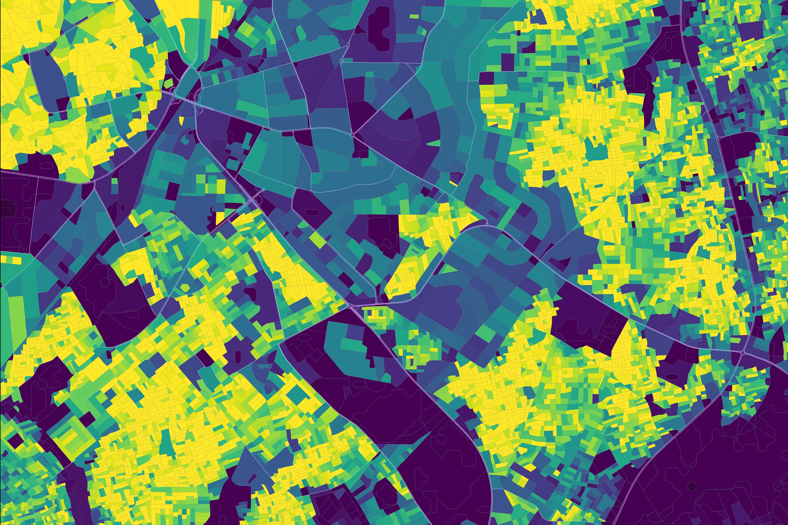
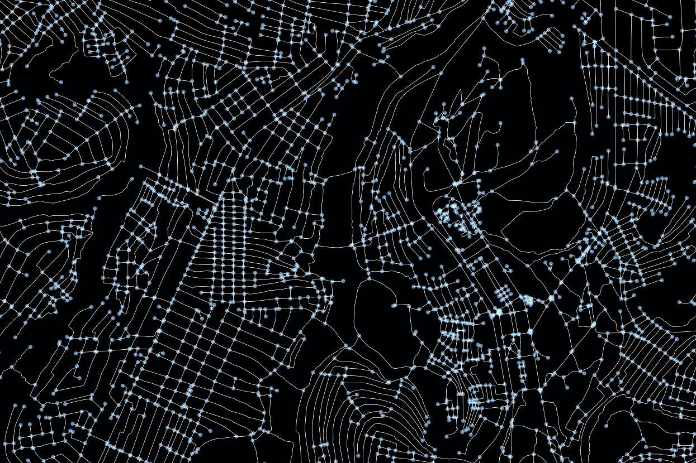
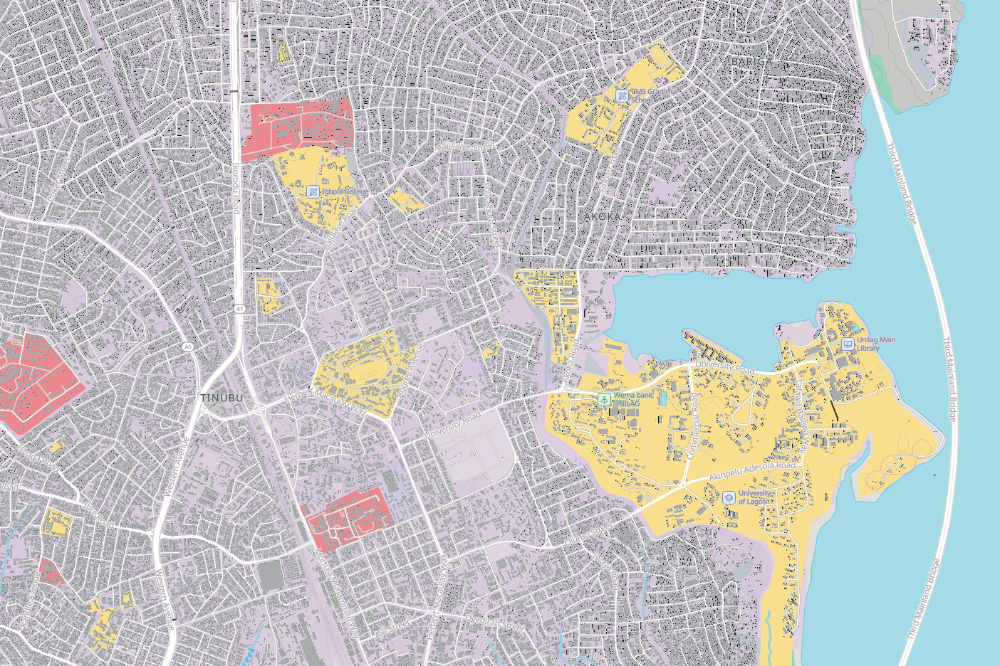
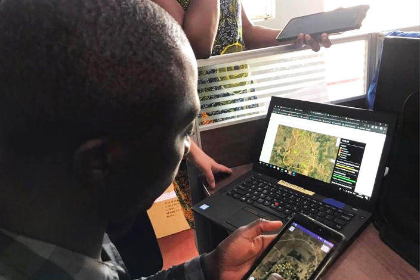

 
This website is a collection of user guides demonstrating ways to access, analyze, and visualize CIESIN GRID3 datasets.

These guides support CIESIN’s effort to strengthen GRID3 sustainability by making spatial data more findable, reproducible, interoperable, and accessible in alignment with open science principles. Designed for users ranging from beginners to advanced practitioners, the guides cover key topics in spatial data workflows, including data access, analysis, and visualization. Each guide is delivered as a Jupyter Notebook and includes code examples, explanations, and visualizations to help users effectively work with GRID3 spatial data in a variety of contexts.
 

For more information, please visit the [GRID3 Data Catalog](https://data.grid3.org/) and the [CIESIN, Columbia Climate School](https://ciesin.columbia.edu/) websites.

## Getting started

::: {.cards-grid}

::: {.card}

::: {.card-overlay}
### Data Access
Find, download, and initialize GRID3 datasets.

[View guides →](pages/data-access/index.qmd){.stretched-link}
:::
:::

::: {.card}

::: {.card-overlay}
### Analysis
Apply GRID3 data to spatial workflows.

[View guides →](pages/analysis/index.qmd){.stretched-link}
:::
:::

::: {.card}

::: {.card-overlay}
### Visualization
Map and style GRID3 data.

[View guides →](pages/visualization/index.qmd){.stretched-link}
:::
:::

::: {.card}

::: {.card-overlay}
### Resources
Links and other reference materials.

[View resources →](pages/resources/index.qmd){.stretched-link}
:::
:::

:::

